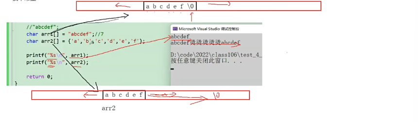
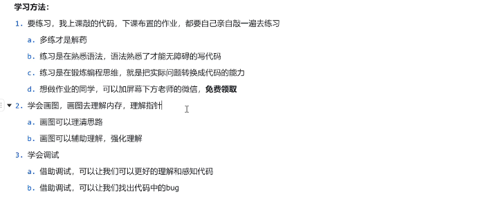
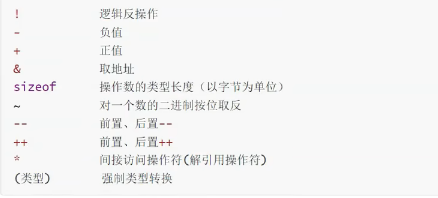
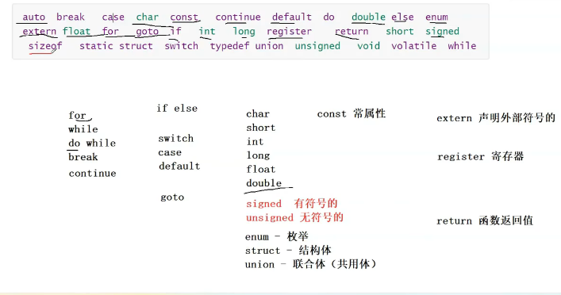
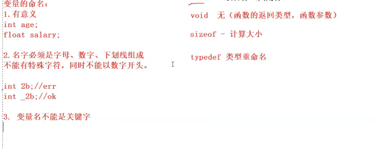
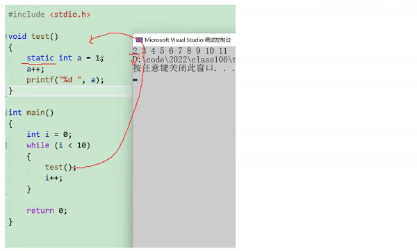
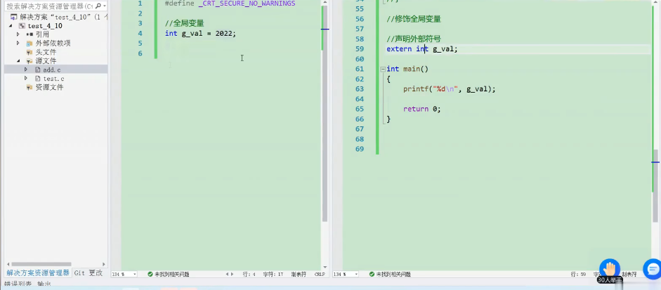

# c语言

#### 初始c语言


编辑器：编辑功能

编译器：编译功能->c/c++是编译型语言 

#### 第一个c语言

> c语言一定要有main函数,为主函数:

```c
#include <stdio.h>
//std-标准 i-input o-output
//用来告诉编译器,使用了库函数
int main()
    //main函数是程序的入口
{
    printf("hello\n")
    //printf是一个库函数
    return 0
    //如果正常运行,就返回0,不正常就返回非零数值
}
//int是整型类型的意思

//快捷键:运行->ctrl+fn+f5
```

#### 数据类型

> char字符串数据类型-一个字节
>
> short短整型 -两个字节
>
> int整形-四个字节
>
> long长整型-四个字节
>
> sizeof(long)>=sizeof(int)
>
> long long更长的整型-八个字节
>
> float单精度浮点数-四个字节
>
> double双精度浮点数-八个字节
>
> 使用类型的原因是向内存申请一个空间

- 计算机单位:
  - bit:比特位,最小,八个比特位是一个字节
  - byte:字节,1024个字节是一个kb
  - kb
  - mb
  - gb
  - tb
  - pb

```c
char ch ="w"
int weight=120
```


#### 常量和变量

常量tm就是不变的量

```c
int b =20
    //全局变量

extern int a;
//声明来自外部的符号

void text()
{
    printf("text-->a",a)
}
    
int main()
{
    int a = 100
    printf("a=%d",a)
        //局部变量,局部和全局冲突的时候,局部优先
    scanf("%d %d",&num1,&num2)
    //这个方法要输入地址,可能会报错这个函数不安全
    return 0
}
//不要将全局和局部变量的名字写出一样的
```

- 变量的作用域和生命周期

  - 局部变量的作用域是变量所在的局部范围,全局变量的作用域是整个工程

    限定整个名字可用性的是变量所在的作用域

  - 生命周期:局部变量的生命周期:进入作用域开始,出作用域结束.全局变量的生命周期:整个程序的生命周期

  - 作用域和生命周期是有点关系的

- 常量：描述不变的量

  - 字面常量

    > a = 10

  - cons定义的常变量

    > const int a = 10本质上是一个变量，但不能直接被修改，有常量的属性

  - #define定义的标识符常量

  - 枚举常量

- **字符串：**

  “sasdad”这种双引号引起来的一串字符称为字符串字面量，或者简称字符串
  字符串的结束标志是一个|0的转义字符,在计算字符串长度的时候|0是结束标志,不算字符串内容

  c语言并没有字符串类型，只有字符类型 

  ```c
  char arr[]="aedsfsdd"
       
      strlen("abc")//求长度的函数,返回数字
      strlen(arr)//8
  ```

  

  arr2后面没有|0，导致在内存中继续往下打印，生成了无关的东西。\0是结束标志

- **转义字符:**

  即转变字符的意思,如:

  - \n换行

  - \0结束

  - \?在书写连续多个问好时使用,防止他们被解析成三字母词

  - \'用来表示字符常量'和\"一样

  - \\用来表示一个反斜杠,防止他被解释为一个转义序列符

  - \a警告字符,蜂鸣

  - \b退格符

    \f进纸符

  - \r回车符

  - \t水平制表符

  - \v垂直制表符

  - \ddd表示1-3八进制的数字,如:\130x(八进制是0-7)

  - \xdd dd表示2个十六进制数字,如:\x30 0

  - 把他们转义成十进制的转义字符

  - 现在已经没有三字母词了,不转义的三字母词会出现方块 

    ​

  > 打印的特殊情况
  >
  > %d-打印整型
  >
  > %c-打印字符
  >
  > %s-打印字符串
  >
  > %f-打印float类型的数据
  >
  > %lf-打印doublr类型的数据
  >
  > 只有字符串可以省略一些打印方式,其他要严格使用

  ​

  - 编码:
    - ascll编码:把字符转化成十进制数字再转换成二进制数字

- **注释:**不需要的代码删掉或者注释掉,代码太难可以写注释来解释

  - // 可以嵌套
  - /**/  不能嵌套注释

- **学习方法：**

  

- **选择语句：**

  ```c
  if（条件作判断）
  {
  //相关语句
  }
  else
  {
  //相关语句
  }

  return xxx
  ```


- **循环语句:**

  - while循环

    ```c
    while(line<20000)
    {
        printf("写代码")
        line++
    }

    return 0
    ```

    ​

  - for循环

  - do....while循环

- **函数：**简化代码,复用代码

  ```c
  Add（int x,int y）{
      int z = 0;
      z=x+y;
      return z
  }

  int main()
  {
      int n1=0;
      int n2=0;
      int sum =Add(n1,n2)
          printf("%d",sum)
      return 0
  }
  ```

- **数组:**一组相同类型的元素的集合

  ```c
  int arr[10]=[1,1,1,1,1,1,1,1,1,1,1,1] 
  //数组的大小被限制了
  ```

- **操作符:**

  - 算数操作符:+ - * / %

    > %是取余,/是除
    >
    > 除号两端是整数,执行整数除法,如果两边又一个浮点数的话,就执行浮点数除法
    >
    > a+=3\a-=3

  - 移位操作符>>  <<

  - 位操作符:& ^ |

  - 赋值操作符:= += -= *= /= ^= != >>= <<=

  - 单目操作符:

    > 
    >
    > sizeof计算数组的话,就是计算整个数组的大小
    >
    > ++/--先把值赋给b,再去加加减减(后置)
    >
    > 前置++/--就是先加加/减减再去使用
    >
    > int a =(int)3.14强制类型转换

  - 关系操作符:> >= < <= != ==

  - 逻辑操作符:&& ||

  - 条件操作符:三元表达式x?c:d

  - 逗号表达式:a,x,x,...ssss

    是一串逗号隔开的一串表达式,从左向右依次计算 ,整个表达式的结果是最后一个表达式的结果 

- **常见关键字:**

  是c语言内置的，关键字不是自己创建的

  


  变量的名字不能是关键字



- typedef和static:

  > typedef就是类型重命名,即类型定义

  ```c
  typedef unsigned int uint//uint是别名

  int main{
      unsigned int num =0
          uint num2=1
          
          return 0
  }
  ```

  > static是用来修饰变量和函数
  >
  > 1. 修饰局部变量，成为静态局部函数
  >
  > 2. 修饰全局变量，成为静态全局函数
  >
  > 3. 修饰函数，成为静态函数
  >
  > 4. 
  >
  > 5. 这个函数在调用后不会初始化，本质上是static修饰局部变量的说话，局部变量出了作用域，不销毁的。修饰局部变量的时候，改变了变量的存储位置
  >
  > 6. ​ void text(){}表示这个函数不需要返回
  >
  > 7. 全局变量：使用extent声明一个变量(函数)再使用，被static修饰的全局变量的外部连接属性就变成了内部属性，其他源文件（.c）不能使用全局变量
  >
  >    函数也是有外部连接属性的
  >
  >    
  >
  > 8.   regesiter 寄存器关键字:建议变量存放在寄存器中,这样访问会更快,编译器会决定是否将数据防在寄存器中,防止挤爆寄存器(寄存器会自动把变量放在寄存器里面)
  >
  >    电脑储存设备:寄存器,高速缓存,内存,硬盘(最大,速度较慢,造价低)

- **#define定义宏:**

  ​


