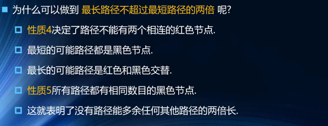
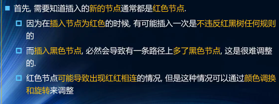
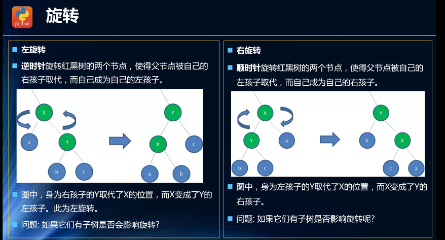
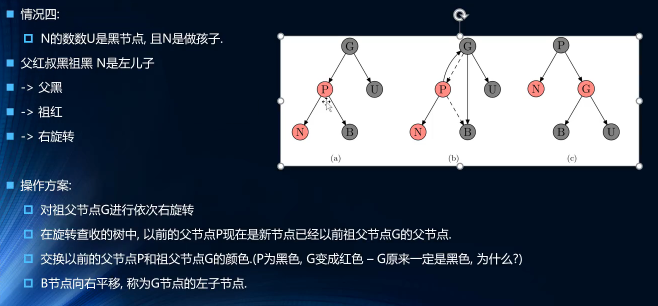
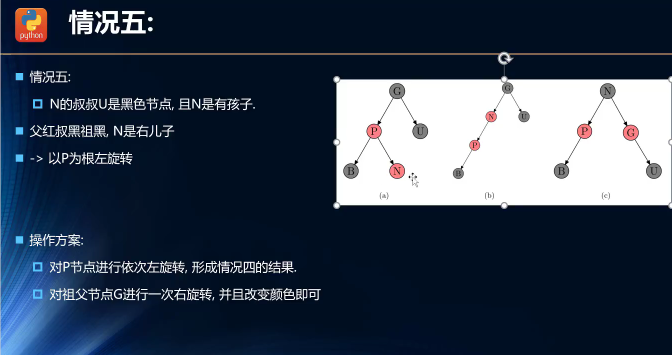

# 算法


#### - 数组方法

- push(),压栈
- pop()弹栈
- unshift()入队，改变原数组
- shift()出队
- concat()会在当前数组尾部拼接传入的数组，然后返回一个新数组，原数组不变
- indexOf(x)返回x下标
- includes()在数组中寻找该值，找到则返回`true`，找不到则返回`false`
- join()数组转换字符串，可以设置分割符
- reverse()翻转原数组
- slice(start,end)读取[start，end）
- splice(start,deleteCount,itme1...)从start开始截取到deleteCount（截取多少个），并添加itme1等追加元素，返回被删除元素的组成的数组，并且改变原数组
- sort()排序：arr.sort((a, b) => b - a)翻转
- toString()把数组转换为字符串，并且用逗号隔开

#### -字符串方法

- charAt(x)返回索引x位置处的字符

- str1.concat(str2)输出合并字符串

- `indexOf()`,返回一个字符在字符串中首次出现的位置,`lastIndexOf()`返回一个字符在字符串中最后一次出现的位置。

- slice()提取字符串的片段

- split()

  ```
  const str = 'A*B*C*D*E*F*G'
  console.log(str.split('*')) // 输出 ["A", "B", "C", "D", "E", "F", "G"]
  ```


#### -时间空间复杂度

- 常见复杂度大小比较：O(n^2) > O(nlogn) > O(n) > O(logn) > O(1)
- 时间复杂度：
  - O(n^2)：2层循环（嵌套循环）
  - O(nlogn)：快速排序（循环 + 二分）
  - O(n)：1层循环
  - O(logn)：二分
- 空间复杂度：
  - O(n)：传入一个数组，处理过程生成一个新的数组大小与传入数组一致

#### -数据结构js

- 栈：`栈`是一个`后进先出`的数据结构。`JavaScript`中没有`栈`，但是可以用`Array`实现`栈`的所有功能

- 队列：`队列`是一个`先进先出`的数据结构 。`JavaScript`中没有`队列`，但是可以用`Array`实现`队列`的所有功能。//派对的都是队列

  

  - 应用场景：线程队列（让线程依次启动，处理对应任务，防止线程过多，占用资源过多）、打印队列

  - 相关操作

    

  ```javascript
  function Queue(){
      //属性
      this.items=[]
     
      //方法
      //向队伍尾加一个元素
      Queue.prototype.enqueue=function(element){
          this.items.push(element)
      }
      
      //删除前面一个ele
      Queue.prototype.dequeue=function(){
          return this.items.shift()
      }
      
      
      //返回队伍第一个元素
      Queue.prototype.fornt=function(){
          return this.itmes[0]
      }
      
      //查看队列里元素的个数
      Queue.prototype.size=function(){
          return this.items.length
      }
      
      //查看队列里元素是否为空
      Queue.prototype.size=function(){
          return this.items.length==0
      }
      
      //tostring方法
      Queue.prototype.tostring=function(){
          return itmes.join('')
      }
  }
  ```

- 优先级队列：

  

  - 额外考虑：

    每个元素不再是一个数据，而是包含数据的优先级

    在添加方式中，根据优先级放入正确的位置

    应用：登机顺序，急诊科候诊室，任务队列

  ```javascript
  function p(){
      
      function QueueElement(element,priority){
          this.element=element
          this.priorty=priority
      }
      //用来储存优先级这些，用一个内部类
      
      
      //属性
      this.items=[]
      
      
      //实现插入方法
      p.prototype.enqueue=function (element,priority){
          //创建queueelement对象
          var queueElement=new QueueElemnt(element,priority)
          
          //判断队列是否为空
          if(this.items.length==0){
              this.items.push(queueElement)
          }else{
              let added=false
              for(let i=0;i<this.items.length;i++){
                  if(queueElement.priorty<this.items[i].priorty){
                      this.items.splice(i,0)
                      added=true
                      break
                  }
              }
              if(!added){
                  this.items.push(queueElement)
              }
          }
      }
  }
  ```

  ​

  ​

  ​

  ​


- `链表`是多个元素组成的列表，元素存储不连续，用`next`指针连在一起。`JavaScript`中没有`链表`，但是可以用`Object`模拟`链表`。

  ```javascript
  * 定义一个 node 节点
   */
  interface ILinkListNode {
      value: number
      next?: ILinkListNode
  }

  /**
   * 根据数组创建单向链表
   * @param arr 
   * @returns 
   */
  function createLinkList(arr: number[]): ILinkListNode {
      const len = arr.length
      if (len === 0) throw new Error('arr is empty')

      let curNode: ILinkListNode = {
          value: arr[len - 1]
      }
      if (len === 1) return curNode

      for (let i = len - 2; i >= 0; i--) {
          curNode = {
              value: arr[i],
              next: curNode 
          }
      }

      return curNode
  }
  ```


​      

- 双向链表：

  ​

  - 单向链表一般只能从头部遍历到尾部或者从尾部遍历到头部，实际上是上一个链表有应该向下的引用

    缺点也很大，可以很容易到达下一个节点但是很难回到上一个节点，就像一个文本阅读器，只能往前，不能回退

    ​

  - 双向链表：既可以冲头到尾，也可以从尾到头，相连的过程是双向的，一个节点既有向前的引用，也有向后的引用，可以解决单向链表中的问题 

    缺点：每次在插入或删除时，需要处理四个引用，而不是两个，也就是实现起来困难一些，占用更大的内存空间

    ​

```javascript
//封装一个双向链表
function LinkedList(){
    
    //内部类:节点
    function Node(data){
        this.prev=null
        this.next=null
        this.data=null
    }
    
    //属性
    this.head=null
    this.tail=null
    this.length=0
    
    
    //常见的操作：方法
    //追加方法
    LinkedList.prototypr.append=function(data){
        //判断是否是第一个节点
        if(this.length==0){
            var newNode=new Node(data)
            this.head=newNode
        }else{
            var newNode=new Node(data)
            var current=this.head
             
            while (current.next){
                current=current.next
            }
            //找到最后一个节点并进行操作
            current.next=newNode
        }
    }
    
    
    
    //特定插入一项节点
    LinkedList.prototype.insert=function(position,data){
        if(position<0||postion>this.length)return false
        
        //开始
        var newNode=new Node(data)
        
        //判断长度是不是0
        if(this.length==0){
            this.head=newNode
            this.tail=newNode
        }else{
            if(position=0){
                this.head.prev=newNode
                newNode.next=this.head
                this.head=newNode   
            }else if(position==this.length){
                this.tail.next=newNode
                newNode.prev=this.tail
                this.tail=newNode
            }else{
                var current =this.head
                var index =0
                
                while(index++<position){
                    current=current.next
                }
                
                current.prev.next=newNode
                newNode.prev=current.prev
                current.prev=newNode
                newNode.next=current

            }
            this.length+=1
        }
        
        
        return true
    }
    //get方法
    LinkedList.prototype.indexOf=get=function(position){
        //越界判断
        if(position<0||postion>=this.length)return null
        
        //拿到那个元素
        var current=this.head
        var index=0
        
        while(index++<position){
            current=current.next
        }
        
        return current.data
    }
    
    
    
    //indexOf返回引索
    LinkedList.prototype.indexOf=function(data){
        var current=this.head
        var index=0
        
        //查找相同的节点数据
        while(current){
            if(current.data==data){
                return index
            }
            index++
            current=current.next
        }
        return -1
    }
    
    
    
    
    
    //修改更新某个节点
    LinkedList.prototype.removeAt=updata=function(position,newData){
        if(position<0||postion>=this.length)return false
        
        //寻找正确的节点
        var current=this.head
        var index=0
        while(index++<position){
            current=current.next
        }
        
        current.data=newdata
        return true
    }
    
    
    
    
    //removeAt,移出某一项
    LinkedList.prototype.removeAt=function(position){
        if(position<0||postion>=this.length)return null
        
        //只有一个节点的情况下
        var current=this.head
        if(this.length==1){
            this.head=null
            this.tail=null
        }else{
            if(position==0){
                this.head.next.prev=null
                this.head=this.head.next
            }else if(position=this.length-1){
                this.tail.prev.next=null
                this.tail=this.tail.prev
            }else{
                var index=0
                
                
                while (index++<position){
                    current=curent.next
                    current.prev.next=current.next
                    current.next.prev=current.prev
                }
            }
            this.length-=1
            return current.data
        }
    }
    
    //remove方法
    LinkedList.prototype.remove=function(data){
        var position=this.indexOf(data)
        this.removeAt(position)
    }
    
    
    
    
    
    
    
    //链表转字符串方法
    toString=function(){
        return this.backwordString()
    }
    
    
      //返回正向遍历的节点字符串
     LinkedList.prototype.forwordString=function(){
         var current=this.tail
         var result=''
         //依次向后遍历，获得每一个节点
         while(current){
             result+=current.data+' '
             current=current.prev
         }
        return result
    }
    
    
    
    
    //返回反向遍历的节点字符串
     LinkedList.prototype.backwordString=function(){
         var current=this.head
         var result=''
         //依次向后遍历，获得每一个节点
         while(current){
             result+=current.data+' '
             current=current.next
         }
        return result
    }
    
}
```

方法：


  ```javascript
- 集合：`集合`是一个`无序且唯一`的数据结构。`ES6`中有集合：`Set`，集合常用操作：去重、判断某元素是否在集合中、求交集。

  // 去重
  const arr = [1, 1, 2, 2]
  const arr2 = [...new Set(arr)]

  //迭代器
  var myset =new Set()
  myset.add(100)
  myset.size//得到大小
  var myiter=myset.valus()

  for(let i of myiter){//遍历迭代器取值
      console.log(i)
  }

  myiter.next()//从迭代器取值
  ```


  ```javascript
  // 判断元素是否在集合中

  const set = new Set(arr)

  const has = set.has(3) // false

  // 求交集

  const set2 = new Set([2, 3])

  const set3 = new Set([...set].filter(item => set2.has(item)))

  //求并集

  var mysetA =new Set([1,2,3])

  var mySetB =new Set([2,3,4])

  var myset = new Set([...mysetA,...mysetB])

  //求差值

  const set2 = new Set([2, 3])

  const set3 = new Set([...set].filter(item => !set2.has(item)))//用！来取反

  // 判断元素是否在集合中

  const set = new Set(arr)

  const has = set.has(3) // false

  // 求交集

  const set2 = new Set([2, 3])

  const set3 = new Set([...set].filter(item => set2.has(item)))

  //求并集

  var mysetA =new Set([1,2,3])

  var mySetB =new Set([2,3,4])

  var myset = new Set([...mysetA,...mysetB])

  //求差值

  const set2 = new Set([2, 3])

  const set3 = new Set([...set].filter(item => !set2.has(item)))//用！来取反

  ```

- 字典：`字典`也是一种存储`唯一值`的数据结构，但它以`键值对`的形式存储。`ES6`中的字典名为`Map`

  ```
  // 字典
  const map = new Map()

  // 增
  map.set('key1', 'value1')
  map.set('key2', 'value2')
  map.set('key3', 'value3')

  // 删
  map.delete('key3')
  // map.clear()

  // 改
  map.set('key2', 'value222')

  // 查
  map.get('key2')
  ​```javascript

  //总数
  map.size
  ```


- 树：`树`是一种`分层`的数据模型。前端常见的树包括：DOM、树、级联选择、树形控件……。`JavaScript`中没有`树`，但是可以通过`Object`和`Array`构建`树`。树的常用操作：深度/广度优先遍历、先中后序遍历。
- 
- 
- 


  - 二叉树的节点最多有两个，左右两个，左最小，右最大。二叉树基本可以模拟所有的树

  - 

  - ​

    > 二叉树的一些特点：
    >
    > 1. 一个二叉树第i层最大节点个数为2^(i-1),i>=1
    > 2. 深度为k的二叉树有最大节点总数为：2^k,k>=1
    > 3. 对于任何非空二叉树T，若n0表示叶节点的个数，n2比爱上度为2的非叶节点个数，那么两者满足关系n0=n2+1
    > 4. 完美二叉树：除了最下一层节点，其他节点都有两个子节点
    > 5. 完全二叉树：除了最下一层节点，其他各层都有两个子节点，且最后一层从左到右节点连续存在，只缺右侧若干节点，完美二叉树是完全二叉树的特例
    > 6. 通常使用链表表示，把节点封装成一个Node，Node里面存储了节点的数据和指向

  - 术语：树：n个节点构成的有限集合，当n=0时，称为空树，对于任意非空树，有以下性质：树有一个根节点，用r表示，其余节点可分为m个互不相交的有限集，每个集合又是一个树，即子树。

  - 节点的度：节点的子树个数

  - 树的度：树的所有节点中最大的度数

  - 叶节点：度为0的节点（或者叶子节点）

  - 父节点：有子树的节点是其子树的根节点的父节点

  - 子节点：若A节点是B节点的父节点，则称B节点是A节点的子节点，子节点也称孩子节点

  - 兄弟节点：具有同一父节点的个节点彼此是兄弟节点

  - 路径长度和路径：从节点n1到nk的路径为一个节点序列n1、n2、....nk，ni是ni+1的父节点。路径所包含的边的个数为路径的长度

  - 节点的层次：规定根节点在1层，其他任一节点的层数是其父节点层数加1

  - 树的深度：树中所有节点的最大层次是这颗树的深度

  - 二叉搜索树：

    ```javascript
    - const Compare ={
          less:-1,
          bigger:1,
          equ:0
      }

      class Node{
          constructor(key){
              this.key=key
              //根节点
              this.left=null
              this.right=null
          }
      }

      class BST{
          constructor(){
              this.root=null
          }
          insert(key){
              if(this.root==null){
                  this.root=new Node(key)
                  //第一次根节点为空，则创建node
              }else{
                  //递归
                  this.insertNode(this.root,key)
              }
          }
          
    ```


```javascript
  compareFn(a,b){
      if(a===b){
          return Compare.equ
      }
      return a<b?Compare.less:Compare.bigger
  }

insertNode(node,key){
    if(this.CompareFn(keey,node.key)===Compare.less){
        fi(node.left==null){
            node.left=new Node(key)
        }else{
            this.insertNOde(node.left,key)
        }
    }else{
        fi(node.right==null){
            node.right=new Node(key)
        }else{
            this.insertNode(node.right,key)
        }
    }
}

//中序遍历
inOrderMap(callback){
    this.inOrderMapNode(this.root,callback)
}
//callback是一个回调函数
inOrderMapNode(node,callback){
    if(node!==null){
        this.inOrderMapNode(node.left,callback)
        callback(node.key)
        this.inOrderMapNode(node.right,callback)
    }
    //不断回调，传入root，先是把root。left传进去，left作为root继续遍历，直到root（node）为null
}


//先序遍历,先打印最开始的
preOrderMap(callback){
    this.preOrderMapNode(this.root,callback)
}

preOrderMapNode(callback){
    if(node!==null){
        callback(node.key)
        this.preOrderMapNode(node.left,callback)
        this.preOrderMapNode(node.right,callback)
        //调整了这里的值，就是，先将传入的值打印，而不是去先找右节点，在去遍历右节点
    }
}

//后续遍历
postOrderMap(callback){
    this.postOrderMapNode(this.root,callback)
}

postOrderMapNode(callback){
    if(node!==null){
        this.postOrderMapNode(node.left,callback)
        this.postOrderMapNode(node.right,callback)
        callback(node.key)
    }
    
    
    
 //查询
 serchNode(node,key){
     if(node===null){
         return flase
     }
     if(this.compareFn(key,node.key)===Compare.less){
         return this.searchNode(node.left,key)
     }else if(this.compareFn(key,node.key)===Compare.bigger){
         return this.searchNode(node.right,key)
     }else{
         return true
     }
 }

 //最小值查询
min(){
    return this.minNode(this.root)
}

minNode(node){
    let current = node
    while(current!=null&&current.left!=null){
        current = current.left
    }
    return current
}


max(){
    return this.minNode(this.root)
}

max(node){
    let current = node
    while(current!=null&&current.rightl){
        current = current.right
    }
    return current
}
    


  //删除
    
    remove(key){
       this.root= this.removeNode(this.root,key)
    }
    
    
    
    
    
    removeNode(node,key){
        if(node==null){
            return null
        }
        if(this.compareFn(key,node.key)===Compare.less){
            node.left= this.removeNode(node.left,key)
            return node
        }else if(this.compareFn(key,node.key)===Compare.bigger){
            node.right= this.removeNode(node.right,key)
            return node
        }else{
            if(node.left==null&&node.right==null){
                node=null
                return node
            }
        }
        
        if(node.left==null){
            node=node.right
            return node
            
        }else if(node.right==null){
            node=node.left
             return node
        }
        
        //找到最小的
        const target = this.minNode(node.right)
        node.key = target.key
        node.right =this.removeNode(node.right,target.key)
        return node
        
        
    }
    
    }

}

var mytree = new BST()


```

- 平衡树：

  > 二叉搜索树的缺陷：插入有序的数据的时候，又可能导致左边或者右边比重太大
  >
  > 形成非平衡树的结构
  >
  > 
  >
  > 为了能较快操作一颗树，要保证树是平衡的
  >
  > 平衡树：AVL树、红黑树

- 红黑树：

  > 规则:
  >
  > 1. 节点是红色或黑色
  >
  > 2. 根节点是黑色
  >
  > 3. 每个叶子节点都是黑色的空节点
  >
  > 4. 每个红色节点的两个子节点都是黑色(从每个叶子到根的所有路径上不能有两个连续的红色节点)(不会有两个连续的红色节点)
  >
  > 5. 从任一节点到其每个叶子的所有路径都包含相同数目的黑色节点
  >
  >    ​
  >
  >    **这些搞不懂的规则,保证了一棵树的平衡**(不平衡也会是比较高效的一棵树)
  >
  > ​
  >
  > 特性：
  >
  > 1. 从根到叶子的最长可能路径，不会超过最短可能路径的两倍长
  >
  > 2. 
  >
  >    ​
  >
  >    ​

  - 当插入一个节点可能导致树不再平衡，可以通过三种方法变换，让树保持平衡(换色-左旋转-右旋转)

    > 变色:为了重新符合红黑树的规则,尝试把红色个节点变为黑色,或者把黑色变为红色
    >
    > 
    >
    > 旋转:
    >
    > 

- **插入：**

  - 规定：

    设要插入的节点为N，其父节点为P，其祖父节点为G，其父亲的兄弟节点为U（P和U是同一个节点的子节点）

  - 情况1：新节点位于树的根上，没有父节点，这种情况下，直接将红色装换为黑色

  - 情况2：新节点的父节点P是黑色，性质45都没失效，尽管他的子节点是两个黑色的空节点，但路径里的黑色节点个数依然相同

  - 情况3：P是红色U也是红色

    方案：将P和U变换为黑色，并将G变换为红色， 现在新节点N有了一个黑色的父节点P，所以每条路径的黑色节点数目不变，而从更高的路径上，必然都会经过G节点，所以那些路径的黑色节点数目也是不变的，符合性质5

    问题：但是,N的祖父节点G的父节点也可能是红色,这就违反了性质3,可以递归的调整颜色但是如果递归调整颜色到了根节点,就需要进行旋转了,待会儿我们的例子中会遇到这个问题.

  - 情况4：P节点是红色，G节点是黑色，U是黑色，并且N是左子节点 

    

  - 情况5：

    

    左旋转再右旋转 

    ​


 


    > 遍历

- 图：`图`是网络结构的抽象模型，是一组由边连接的节点。图可以表示任何二元关系，比如道路、航班。JS中没有图，但是可以用`Object`和`Array`构建`图`。图的表示法：邻接矩阵、邻接表、关联矩阵。//树可以说是图的一种
- 图：`图`是网络结构的抽象模型，是一组由边连接的节点。图可以表示任何二元关系，比如道路、航班。JS中没有图，但是可以用`Object`和`Array`构建`图`。图的表示法：邻接矩阵、邻接表、关联矩阵。//树可以说是图的一种
- 图：`图`是网络结构的抽象模型，是一组由边连接的节点。图可以表示任何二元关系，比如道路、航班。JS中没有图，但是可以用`Object`和`Array`构建`图`。图的表示法：邻接矩阵、邻接表、关联矩阵。//树可以说是图的一种
- 图：`图`是网络结构的抽象模型，是一组由边连接的节点。图可以表示任何二元关系，比如道路、航班。JS中没有图，但是可以用`Object`和`Array`构建`图`。图的表示法：邻接矩阵、邻接表、关联矩阵。//树可以说是图的一种
- 图：`图`是网络结构的抽象模型，是一组由边连接的节点。图可以表示任何二元关系，比如道路、航班。JS中没有图，但是可以用`Object`和`Array`构建`图`。图的表示法：邻接矩阵、邻接表、关联矩阵。//树可以说是图的一种

  > 图相关说明（研究事务之间的关系，顶点代表事物，边代表两个事物间的关系）
  >
  > ​
  >
  > 特点：一组顶点：通常用v表示顶点的集合
  >
  > 一组边：通常用E表示边的集合，边是顶点与顶点的连线，边可以有向也能无向
  >
  > ​
  >
  > 有向图和无向图

  ​

  > 术语：
  >
  > 1.顶点：表示图中的某一个节点
  >
  > 2.边：边代表两个点间的连线  
  >
  > 3.度：一个顶点的度是相邻顶点的数量
  >
  > 4.路径：路径是顶点v1，v2....vn的一个梁旭序列，简单路径要求不包含重复的顶点，回路是第一个顶点和最后一个顶点相同的路径
  >
  > 5.无向图：所有的边都是没有方向的
  >
  > 6.有向图：图中的边都是有方向的
  >
  > 7.无权图：图上的边是没有任何意义的
  >
  > 8.带权图：边有一定的比重，可以是我任何想要表示的数据

  ​

  ​

  > 图的表示：
  >
  > 1.邻接矩阵：让每个节点和一个整数联系，该整数作为数组下标值
  >
  > 
  >
  > 如果图是稀疏图的话，矩阵中存在大量的0，回浪费很多的空间去表示根本不存在的边
  >
  > ​
  >
  > 2.领接表
  >
  > 类似上面那个图：a指向其他的表

  ```javascript
  function Graph(){
      //封装字典
      this.vertextes=[]
      //存储所有的顶点
      this.edges=new Dictionay()
      //存储所有的边，使用的是邻接表,且dictionay是一个字典
      
      //方法
      //添加顶点
      Graph.prototype.addVertex=function(v){
          this.vertextes.push(v)
          this.edges.se(v,[])
          //v作为键，[]什么都没有添加，是空数组
      }
      
      //添加边的方法
      Graph.prototype.addEdges=function(v1,v2){
          this.edges.get(v1).push(v2)
          this.edges.get(v2).push(v1)
          //无向表
      }
      
      
      //实现tostring方法
      Graph.prototype.toString=function(){
          //保存最终结果
          var resultString=''
          
          //遍历所有的顶点以及所有对应的边
          for(var i=0;i<this.vartexes.length;i++){
              resultString=this.vertexes[i]+'->'
              var vEdges=this.edges.get(this.vertexes[i])
              for(var j=0;j<vEdges.length;j++){
                  resultString+=vEdges[j]+' '
              }
               resultString+='\n'
          }
          return  resultString
      }
      //返回A->B C D既是A对应的边的箭头
      
      
      
      //遍历：就是吧顶点都访问一遍，且不能重复，(七桥问题)
      //类型：
      //广度优先搜索（BFS）
      //深度优先搜索（DFS）
      //都要明确第一个被访问的点
      //可以用颜色表示这些点的反应：白色：该顶点还没有被访问过，灰色：该顶点被访问过，但还未被探索过，黑色：该顶点被访问过且被完全探索过
      
      
      Graph.prototype.initializeColor=function(){
          var colors = [] 
          for(var i =0;i<this.vartexes.length;i++){
              colors[this.vertexes[i]]='white'
          }
          return colors
          //用颜色记入状态
      }
       
      
      
      //广度优先搜索：会指定第一个顶点开始遍历图，先访问其所有的相邻点，就像访问图的一层，就是先宽后深的访问顶点（实现：创建一个队列Q，将v标注为被发现的灰色，并将v入队列Q，如果Q非空，就将v从Q取出，将v标注为灰色，将v所有的未被访问的邻接点（白色），加入队列中，将v标注为黑色）
      Graph.prototype.bfs=function(initV,handler){
          var colors=this.initializeColor() 
          //1.初始化颜色
          var queue=new Queue()
          //2.创建队列
          queue.enqueue(initV)
          //3.将顶点加入到队列中
          while(!queue.isEmpty()){
              //4.从队列取出顶点
              var v=queue.dequeue()
              
              //获得和顶点相连的另外顶点
              var vlist =this.edges.get(v)
              
              //将v换成灰色
              colors[v]='gray'
              //遍历所有顶点加入队列中
              for(var i = 0;i<vlist.length;i++){
                  var e =vlist[i]
                  if(colors[e]=='white'){
                      colors[e]='gray'
                      queue.enqueue(e)
                      //新的子节点进入队列
                  }
              }  
              //v已经被访问
              //将顶点设为黑色
              handler(v)
              colors[v]='black'
          }
      }
      
      
      
      
      
      
      
      
      
      //深度优先搜索：将会从第一个指定的顶点开始遍历图，沿着路径知道这条路径最后被访问了，实现（可以使用队列或栈或递归完成）
      
      Graph.prototype.dfs=function(initV,header){
          //初始化颜色
          var colors=this.initializeColor()
          
          //从某个顶点开始依次遍历
      }
      
      
      
      graph.prototype.dfsVisit=function(v,colors,hendler){
          //将颜色设置为黑色
          colors[v]='gray' 
          //处理v顶点
          hendler(v)
          
          //访问v相邻的其他顶点
          var vList=this.edges.get(v)
          for(var i =0;i<vList.length;i++){
              var e=vList[i]
              if(colors[e]=='white'){
                  this.dfsVisit(e,clors,handler)
              }
          }
          
          //将v设置成黑色
          
          colors[v]='black   '
      }
  }
  ```


- `堆`是一种特殊的完全二叉树。所有的节点都大于等于（最大堆）或小于等于（最小堆）它的子节点。由于`堆`的特殊结构，我们可以用`数组`表示`堆`。

  二叉堆--二叉树的延申

  ```

  ​
  ```


- 哈希表：


####- 排序算法

- 冒泡算法：

  > 比较相邻的元素。如果第一个比第二个大，就交换他们两个，如果不是相等的就跳过比下面的元素 ，这样依次的循环下去 直到所有的元素都比较完成才结束。

  > 针对所有的元素重复以上的步骤，除了最后一个。
  >
  > 持续每次对越来越少的元素重复上面的步骤，直到没有任何一对数字需要比较。

  ```js
  function bubbleSort(arr) {
      const len = arr.length
      if (len <= 1) return

      for (let i = 0; i < len - 1; i++) {
          for (let j = 0; j < len - i - 1; j++) {
              if (arr[j] > arr[j + 1]) {
                  const temp = arr[j]
                  arr[j] = arr[j + 1]
                  arr[j + 1] = temp
              }
          }
      }
  }

  // 功能测试
  const arr = [4, 3, 6, 2, 5, 7, 9, 8, 1]
  bubbleSort(arr)
  console.log(arr) // [1, 2, 3, 4, 5, 6, 7, 8, 9]

  ```


- 快速排序

  > 通过一趟排序将要排序的数据分割成独立的两部分，其中一部分的所有数据都比另外一部分的所有数据都要小，然后再按此方法对这两部分数据分别进行快速排序，整个排序过程可以递归进行，以此达到整个数据变成有序序列

  ```javascript
   /** 快速排序 (splice)
   * @param arr 
   * @returns 
   */
  function quickSort1(arr: number[]): number[] {
      const len = arr.length
      if (len === 0) return arr

      const midIndex = Math.floor(len / 2)
      const midValue = arr.splice(midIndex, 1)[0]
      //从arr拿arr[midIndex]这个值

      const left: number[] = []
      const right: number[] = []

      // 注意： splice 会修改原数组，所以用 arr.length
      for (let i = 0; i < arr.length; i++) {
          const n = arr[i]
          if (n < midValue) {
              left.push(n)
          } else {
              right.push(n)
          }
      }
      return quickSort1(left).concat([midValue], quickSort1(right))
  }

  /**
   * 快速排序 (slice)
   * @param arr 
   * @returns 
   */
   function quickSort2(arr: number[]): number[] {
      const len = arr.length
      if (len === 0) return arr

      const midIndex = Math.floor(len / 2)
      const midValue = arr.slice(midIndex, midIndex + 1)[0]

      const left: number[] = []
      const right: number[] = []

      for (let i = 0; i < len; i++) {
          if (i === midIndex) continue
          const n = arr[i]
          if (n < midValue) {
              left.push(n)
          } else {
              right.push(n)
          }
      }
      
      return quickSort2(left).concat([midValue], quickSort2(right))
  }

  // 功能测试
  const testArr3 = [3, 2, 5, 1, 8, 7]
  console.info('quickSort2:', quickSort2(testArr3))
  ```

  ​

- 插入排序

  > 插入排序是一种最简单直观的排序算法，它的工作原理是通过构建有序序列，对于未排序数据，在已排序序列中从后向前扫描，找到相应位置并插入。

  ```javascript
  function insertionSort(arr) {
      for (let i = 1; i < arr.length; i++) {
          const temp = arr[i];
          let j = i;
          while (j > 0) {
              if (arr[j - 1] > temp) {
                  arr[j] = arr[j - 1];
              } else {
                  break;
              }
              j--;
          }
          arr[j] = temp;
          //重点是这个
      }
  }

  // 功能测试
  const arr = [4, 3, 6, 2, 5, 7, 9, 8, 1]
  insertionSort(arr)
  console.log(arr) // [1, 2, 3, 4, 5, 6, 7, 8, 9]

  ```


- 归并排序

  - 分割：将待排序的线性表不断地切分成若干个子表，直到每个子表只包含一个元素，这时，可以认为只包含一个元素的子表是有序表。
  - 归并：将子表两两合并，每合并一次，就会产生一个新的且更长的有序表，重复这一步骤，直到最后只剩下一个子表，这个子表就是排好序的线性表。

  ```javascript
  function mergeSort(arr) {
      if(arr.length === 1) return arr
      
      let mid = Math.floor(arr.length / 2)
      let left = arr.slice(0, mid)
      let right = arr.slice(mid)
      
      return merge(mergeSort(left), mergeSort(right))
  }

  function merge(a, b) {
      let res = []
      
      while (a.length && b.length) {
          if (a[0] < b[0]) {
              //小的先放进去
              res.push(a[0])
              a.shift()
          } else {
              res.push(b[0])
              b.shift()
          }
      }
      
      if(a.length){
          res = res.concat(a)
      } else {
          res = res.concat(b)
      }
      //可能有一个数组多出来，所以要把他们链接上去
      return res
  }

  // 功能测试
  const arr = [4, 3, 6, 2, 5, 7, 9, 8, 1]
  console.log(mergeSort(arr)) // [1, 2, 3, 4, 5, 6, 7, 8, 9]
  ```


- 选择排序

  - 首先在未排序的数列中找到最小(or最大)元素，然后将其存放到数列的起始位置
  - 接着，再从剩余未排序的元素中继续寻找最小(or最大)元素，然后放到已排序序列的末尾
  - 以此类推，直到所有元素均排序完毕

  ```javascript
  function selectionSort(arr) {
      for (let i = 0; i < arr.length - 1; i++) {
          let indexMin = i;
          for (let j = i; j < arr.length; j++) {
              if (arr[j] < arr[indexMin]) {
                  indexMin = j;
                  //在未排序的地方寻找最小值，并进行选中
              }
          }
          if (indexMin !== i) {
              const temp = arr[i];
              arr[i] = arr[indexMin];
              arr[indexMin] = temp;
              //交换位置
          }
      }
  }

  // 功能测试
  const arr = [4, 3, 6, 2, 5, 7, 9, 8, 1]
  selectionSort(arr)
  console.log(arr) // [1, 2, 3, 4, 5, 6, 7, 8, 9]
  ```


#### - 搜索算法

- 顺序搜索：从头开始进行遍历，直到选中那个值

  ```javascript
  function sequentialSearch(arr, target) {
      for (let i = 0; i < arr.length; i++) {
          if (arr[i] === target) {
              return i;
          }
      }
      return -1;
  };
  const arr = [4, 3, 6, 2, 5, 7, 9, 8, 1]
  console.log(sequentialSearch(arr, 8)) // 7
  ```

  ​

- 二分搜索：`二分搜索`，也叫`折半搜索`，是一种在`有序数组`中查找特定元素的搜索算法。所以是用二分查找的前提是数组必须是`有序`的.

  > 凡是有序，必二分
  > 凡是二分，时间复杂度必包含 O(logn)
  > 递归代码思路清晰，非递归性能更好

  ```javascript

  ```

  ​

- 内插搜索：


#### -随机算法


```javascript
function shuffle(array){
    for(let i =array.length-1;i>0;i--){
        const randomIndex=Math.floor(Math.random()*(i+1));
        swap(array,i,randomIndex)
        //回调函数
    }
    return array;
}
```


#### -算法设计

- 分而治之：


  >
  > 独立的子问题


#### 


- 动态规划：关注最优解


  >
  > 相互依赖的子问题，第一个子问题依赖第二个子问题得到最优解

- 比如背包问题，给定一个固定大小的背包和不同重量和价值的物品，怎么让背包内的物品重量不超过W并取得最大价值 (右下角是最优选项)


```javascript
function knapSack(weight,values,W){
    var n=weights.length-1
    var f=[[]]
    for(var j=0;j<=W;j++){
        if(j<weights[0]){
            f[0][j]=0
        }else{
            f[0][j]=values[0]
        }
    }
    //排除i-1=-1的可能性
    
    for(var j=0;j<=W;j++){
        for(var i=1;i<=n;i++){
            if(!f[i]){
                f[i]=[]
            }
            
            if(j<weights[i]){
                f[i][j]=f[i-1][j]
            }else{
                f[i][j]=Math.max(f[i-1][j],f[i-1][j-weights[i]]+values[i])
            }
        }
    }
}

knapSack([2,2,6,5,4],[6,3,5,4,6],10)
```


- 最长的公共子序列


```javascript
function LCS(str,str2){
    var m=str1.length
    var n=str2.length
    
    var dp=[new Array(n+1).fill(0)]
    
    for (var i=1;i<=m;i++){
        dp[i]=[0]
        for(var j=1;j<=n;j++){
            if(str1[i-1]===str2[j-1]){
                dp[i][j]=dp[i-1][j-1]+1
            }else{
                dp[i][j]=Math.max(dp[i-1][j],dp[i][j-1])
            }
        }
    }
}
```


- 贪心算法：关注局部最优解，即把性价比最高的东西放进去


  ```javascript
  function tanxin(capacity,weights,values){
      var list =[]
      
      for(var i=0,i<weights.length-1;i++){
          list.push({
              num:i+1,
              w:weights[i]
              v:values[i]
              rate:values[i]/weights[i]
              //性价比和重量加价值
          })
          
          list.sort((a,b)=>b.rate-a.rate)
          //降序
          
          var selects=[]
          var total =0
          //先把价值高的放到数组里面
          for(var i=0;list.length;i++){
              var item =list[i]
              if(item['w']<=capacity){
                  selects.push({
                      {...item},
                      rate:1
                  })
                  total+=item.v
                  capacity-=item.w
              }else if(capacity>0){
                  var rate =capacity/item['w']
                  //比例
                  var v=w:item.v*rate,
                  selects.push({
                      num:item.num
                      rate,
                      v，
                      w:item.v*rate,
                  })
                  total+=v
                  break
              }else{
                  break
              }
          }
      }
  }
  ```

  ​


- 回溯算法：
  - 力扣老鼠迷宫


```javascript
function exist(board,word){
    //设置行列数
    let row =board.length;
    let col =board[0].length;
    
    //双循环，从每个坐标都尝试，作目标的第一元素
    for (let i=0;i<row;i++){
        //从格子中第一个开始找（i,j)，找到第一个字母word[0]
        const ret =find(i,j,0)
        if(ret){
            return ret;
        }
    }
}

return false;//结束了没有找到

//递归函数，第一个元素符合就接着内部再递归find上下左右找第2元素
function find(r,c,cur){
    if(r>=row||r<0)return false;
    if(c>=row||c<0)return false;
    if(board[r][c]!==word[cur])return false;
    //非目标元素要false
    
    //这里开始，确定r，c坐标是目标元素
    let letter =board[r][c]
    //付给中转变量
    board[r][c]=null
    //用null做一下标记，避免find找重复
    
    //下一步，上下左右去找
    //如果是[0][0]是第一个目标元素，就去找[1][0]或者[0][1]
    //没有找到就结束find回到上面进行下一个坐标的find
    
    const=find(r-1,c,cur+1)||find(r+1,c,cur+1)||find(r,c-1,cur+1)||find(r,c+1,cur+1)
    //结束了要把null取消掉
    board[r][c]=letter;
    return ret;
}
```


- 前端加密算法（文件上传相关）


- 哈希表/散列表：

  ​


  >
  > 直接定址法：适合分布连续的情况

  ​

  > 除留余数法：
  >

  >
  > ​
  >
  > 冲突处理：
  >

  >
  > ​
  >
  > 平方探测法： 
  >

  >
  > ​
  >
  > ​
  >
  > 拉链法：防止冲突的另一种方法

  >
  > ​
  >
  > ​
  >
  > ​
  >
  > 哈希表的优势：
  >
  > 1. 有非常快的插入和删除查找
  >
  > 2. 时间复杂度O（1）
  >
  > 3. 比树快很多
  >
  > 4. 哈希表的编码相对来说比较容易
  >
  >    ​
  >
  >    缺点：
  >
  >    1. 数据无序，因此不能以一种固定的方式来遍历（如大小）元素
  >    2. 哈希表中的key是不允许重复的，不能使用相同的key保存元素


> 哈希表的实现:
>
> 1. 字符串转换数字:用AscII码代替
> 2. 哈希化:将转化出来的大数字转化为数组下标的方法,用哈希函数来实现,把哈希化的数字插入表中,为哈希表
> 3. 用取余进行哈希化会造成地址冲突
> 4. 可以用链地址法和开放地址法:线性探测和平方探测法
> 5. 再哈希法：再哈希法的做法就是: 把关键字用另外一个哈希函数, 再做一次哈希化, 用这次哈希化的结果作为步长.

- ​

  ```javascript
  //哈希函数
  function hashFunction(str,size){
      var hashCode=0;
      for(let i=0;i<str.lrngth;i++){
          hashCode=37*hashCode+str.charCodeAt(i)
      }
      
      var index=hashCode%size;
      return index;
  }
  ```

  ​

  ```javascript
  //哈希表

  function HashTable() {
          // 定义属性
          this.storage=[];
          this.count=0;
          this.limit=7;
          // 方法
          //1.哈希函数
          //2.插入和修改数据
     }

  //插入和修改哈希表
   HashTable.prototype.put = function (key,value) {
              // 1.使用哈希函数获取我们在storage的对应位置index
              var index=HashTable.hashFunc(key,this.limit);//上面写的那个哈希函数
              // 2.根据index取出我们的bucket
              var bucket=this.storage[index];
              // 3.如果bucket为空，我们创建bucket
              if (bucket==null) {
                  bucket=[];
                  // 创建bucket
                  this.storage[index]=bucket;
              }
              // 4.遍历bucket判断我们到底是插入还是修改数据（如果找到咋修改key对应的value并返回）
              for (var i = 0; i < bucket.length; i++) {
                  var element = bucket[i];
                  if (element[0]==key) {
                      element[1]=value;
                      return;
                      //这里是进行了修改
                  }
              }
              // 5.进行添加操作
              bucket.push([key,value]);
              this.count+=1;
              //判断是否扩容操作（根据装填因子公式计算）
              if (this.count>this.limit*0.75) {
                  //（这里下一小节单独讲）
              }
              return;
          }

  //get获取元素方法
    HashTable.prototype.get = function (key) {
              // 1.使用哈希函数获取对应的index
              var index=this.hashFunc(key,this.limit);
              // 2.根据index获取bucket
              var bucket=this.storage[index];
              // 3.判断bucket是否为空，若为空则返回null
              if (bucket==null) {
                  return null
              }
              // 4.顺序遍历bucket，若没有则返回null，有则返回value
              for (var i = 0; i < array.length; i++) {
                  var element = array[i];
                  if (element[0]==key) {
                      return element[1]
                  }
              }
              return null
          }

    
    //remove删除元素
    
   HashTable.prototype.remove = function (key) {
              // 1.根据哈希函数获取index
              var index = this.hashFunc(key, this.limit);
              // 2.根据index获取bucket
              var bucket = this.storage[index];
              // 3.判断bucket是否存在，返回null
              if (bucket == null) {
                  return null
              }
              // 4.线性查找bucket，寻找对应数据，并且remove
              for (var i = 0; i < array.length; i++) {
                  var element = array[i];
                  if (element[0] == key) {
                      bucket.splice(i,1);//删除数组中元素
                      this.count-=1;
                      //判断是否需要缩容操作
                      if (this.limit>7&&this.count<this.limit*0.25) {
                          //（这里下一小节单独讲）
                      }
                      return element[1];
                  }
              }
              // 5.没有找到返回null
              return null;
          }

  ```

  ​


0
